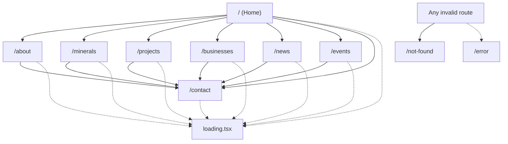
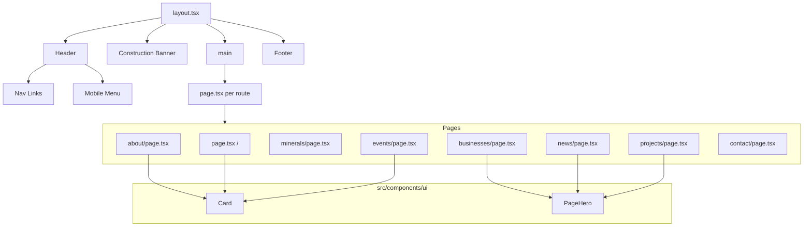
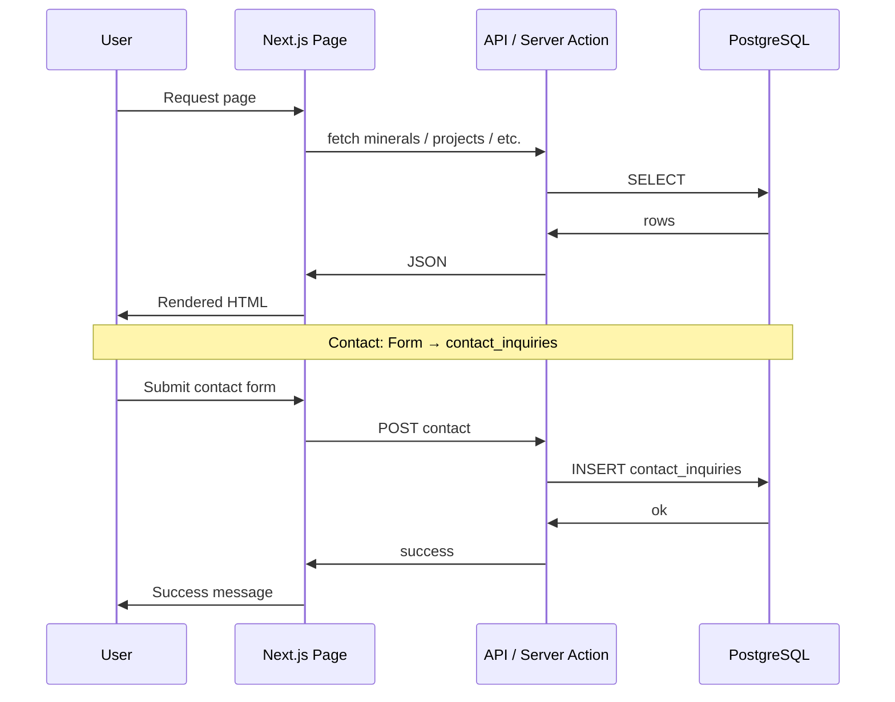

# Ikoha Community Development — Diagrams

Diagrams for the Ikoha Community Development Platform. Use [Mermaid Live](https://mermaid.live) to edit and export, or copy into draw.io, Lucidchart, or Excalidraw.

---

## 1. Entity Relationship Diagram (Database)

**Source:** `DATABASE_SCHEMA.md`, `create_tables.sql`

### Mermaid ERD

```mermaid
erDiagram
    users ||--o{ mineral_resources : "created_by"
    users ||--o{ projects : "created_by"
    users ||--o{ news : "author_id"
    users ||--o{ documents : "uploaded_by"
    users ||--o{ community_info : "updated_by"
    users ||--o{ contact_inquiries : "responded_by"

    users {
        uuid id PK
        string email UK
        string password_hash
        string full_name
        enum role "admin,member,visitor"
        string phone
        string address
        string profile_image_url
        bool is_verified
        timestamp created_at
        timestamp updated_at
        timestamp last_login
    }

    mineral_resources {
        uuid id PK
        string name
        enum category "metallic,non-metallic,energy,precious"
        text description
        string location_description
        decimal coordinates_lat
        decimal coordinates_lng
        string estimated_reserves
        enum extraction_status "active,inactive,planned,exploration"
        string mining_company
        string license_number
        date license_expiry
        uuid created_by FK
        timestamp created_at
        timestamp updated_at
    }

    projects {
        uuid id PK
        string title
        text description
        enum category "infrastructure,education,healthcare,water,energy,other"
        enum status "planning,in_progress,completed,on_hold"
        date start_date
        date expected_completion_date
        date actual_completion_date
        decimal budget
        string location
        int progress_percentage
        uuid created_by FK
        timestamp created_at
        timestamp updated_at
    }

    businesses {
        uuid id PK
        string name
        enum category "retail,service,manufacturing,agriculture,mining,other"
        text description
        string owner_name
        string email
        string phone
        string address
        bool is_verified
        timestamp created_at
        timestamp updated_at
    }

    news {
        uuid id PK
        string title
        string slug UK
        text content
        string excerpt
        enum category "general,development,minerals,events,announcements"
        string featured_image_url
        uuid author_id FK
        bool is_published
        timestamp published_at
        int views_count
        timestamp created_at
        timestamp updated_at
    }

    events {
        uuid id PK
        string title
        text description
        enum event_type "meeting,festival,workshop,celebration,other"
        timestamp start_date
        timestamp end_date
        string location
        string organizer
        bool is_published
        timestamp created_at
        timestamp updated_at
    }

    documents {
        uuid id PK
        string title
        text description
        enum category "legal,financial,environmental,technical,reports,other"
        string file_url
        string file_type
        bool is_public
        uuid uploaded_by FK
        int download_count
        timestamp created_at
        timestamp updated_at
    }

    community_info {
        uuid id PK
        enum section "history,demographics,culture,leadership,location"
        string title
        text content
        jsonb images
        int display_order
        bool is_active
        uuid updated_by FK
        timestamp created_at
        timestamp updated_at
    }

    contact_inquiries {
        uuid id PK
        string name
        string email
        string phone
        string subject
        text message
        enum inquiry_type "general,investment,partnership,media,other"
        enum status "new,in_progress,resolved,archived"
        uuid responded_by FK
        text response_notes
        timestamp created_at
        timestamp updated_at
    }
```



### Table list (for draw.io / manual ERD)

| Table | Key Columns | FK To |
|-------|-------------|-------|
| **users** | id (PK), email (UK), role | — |
| **mineral_resources** | id (PK), created_by (FK→users) | users |
| **projects** | id (PK), created_by (FK→users) | users |
| **businesses** | id (PK) | — |
| **news** | id (PK), slug (UK), author_id (FK→users) | users |
| **events** | id (PK) | — |
| **documents** | id (PK), uploaded_by (FK→users) | users |
| **community_info** | id (PK), updated_by (FK→users) | users |
| **contact_inquiries** | id (PK), responded_by (FK→users) | users |

---

## 2. System / Application Architecture

### Mermaid

```mermaid
flowchart TB
    subgraph Client["Client (Browser)"]
        UI[Next.js Frontend]
    end

    subgraph Hosting["Netlify"]
        CDN[CDN / Edge]
        Next[Next.js App]
        SSG[Static / SSG]
        ISR[ISR / Server]
    end

    subgraph Data["Data Layer (Planned)"]
        DB[(PostgreSQL\n"Ikoha Community Development")]
        FS[File Storage\nImages, PDFs]
    end

    subgraph External["External"]
        GM[Google Maps API]
        Mail[Email / Contact]
    end

    UI --> CDN
    CDN --> Next
    Next --> SSG
    Next --> ISR
    ISR --> DB
    ISR --> FS
    Next --> GM
    Next --> Mail
```

### Stack (text)

| Layer | Technology |
|-------|------------|
| **Framework** | Next.js 14+ (App Router) |
| **Language** | TypeScript |
| **Styling** | Tailwind CSS, Bootstrap (minimal), AOS, Framer Motion |
| **Hosting** | Netlify |
| **Database** | PostgreSQL (planned) — DB name: `"Ikoha Community Development"` |
| **Maps** | Google Maps (embed / API) |
| **Deployment** | `netlify.toml`, Next.js plugin |

### ASCII

```
┌─────────────────────────────────────────────────────────────────┐
│                        Browser (User)                            │
└─────────────────────────────┬───────────────────────────────────┘
                              │
                              ▼
┌─────────────────────────────────────────────────────────────────┐
│  Netlify  │  CDN  →  Next.js (SSR/SSG/ISR)  →  API Routes       │
└─────────────────────────────┬───────────────────────────────────┘
                              │
         ┌────────────────────┼────────────────────┐
         ▼                    ▼                    ▼
┌─────────────────┐  ┌─────────────────┐  ┌─────────────────┐
│   PostgreSQL    │  │  File Storage   │  │  Google Maps    │
│  (Ikoha DB)     │  │  (images, docs) │  │  (optional)     │
└─────────────────┘  └─────────────────┘  └─────────────────┘
```

---

## 3. Site Map / Navigation (User Flow)

### Mermaid flowchart



### Routes (flat list)

| Route | Page | Description |
|-------|------|-------------|
| `/` | `src/app/page.tsx` | Home — hero, stats, resources, gallery, administration, CTA |
| `/about` | `src/app/about/page.tsx` | About — history, leadership, Oba, map, location |
| `/minerals` | `src/app/minerals/page.tsx` | Mineral resources |
| `/projects` | `src/app/projects/page.tsx` | Development projects |
| `/businesses` | `src/app/businesses/page.tsx` | Business directory |
| `/news` | `src/app/news/page.tsx` | News & updates |
| `/events` | `src/app/events/page.tsx` | Events & festivals |
| `/contact` | `src/app/contact/page.tsx` | Contact form |
| — | `error.tsx` | Error boundary |
| — | `not-found.tsx` | 404 |
| — | `loading.tsx` | Global loading UI |

### Header navigation order

1. Home → 2. About → 3. Minerals → 4. Projects → 5. Businesses → 6. News → 7. Events → 8. Contact ( + Contact CTA button )

---

## 4. Component Hierarchy

### Current (as implemented)



### Folder tree (actual)

```
src/
├── app/
│   ├── layout.tsx          # Root: Header, Construction Banner, main, Footer
│   ├── page.tsx            # Home
│   ├── loading.tsx
│   ├── error.tsx
│   ├── not-found.tsx
│   ├── about/page.tsx
│   ├── businesses/page.tsx
│   ├── contact/page.tsx
│   ├── events/page.tsx
│   ├── minerals/page.tsx
│   ├── news/page.tsx
│   └── projects/page.tsx
├── components/
│   ├── layout/
│   │   ├── Header.tsx
│   │   └── Footer.tsx
│   └── ui/
│       ├── Card.tsx
│       └── PageHero.tsx
├── lib/
│   └── utils.ts
└── styles/
    └── globals.css
```

### Planned (from FOLDER_STRUCTURE.md)

- `src/app`: `minerals/[id]`, `projects/[id]`, `businesses/[id]`, `news/[slug]`, `events/[id]`, `resources/`, `admin/` (+ sub-routes)
- `src/components`: `ui/` (Button, Input, Modal, Badge, Loading), `minerals/`, `projects/`, `businesses/`, `news/`, `events/`, `forms/`, `maps/`
- `src/lib`: `db/`, `api/`, `auth/`, `hooks/`

---

## 5. Page Structure (Layout Anatomy)

### Mermaid

```mermaid
flowchart TB
    subgraph Layout
        H[Header: Logo, Nav, Contact CTA]
        B[Construction Banner]
        M[main]
        F[Footer: Brand, About, Resources, Contact, Copyright]
    end

    M --> C[Page Content]

    subgraph HomeContent
        Hero[Hero]
        Stats[Stats]
        Resources[Featured Resources]
        Gallery[Community Gallery]
        Admin[Administration]
        AboutBlurb[About Blurb]
        CTA[CTA]
    end

    subgraph TypicalPage
        pHero[PageHero or Title]
        pBody[Section(s)]
        pCTA[Optional CTA]
    end

    C --> HomeContent
    C --> TypicalPage
```

---

## 6. Data Flow (Planned, when DB connected)



---

## 7. How to Use These Diagrams

### Mermaid

- Paste any ` ```mermaid ` block into [mermaid.live](https://mermaid.live) to edit and export as PNG/SVG.
- Mermaid renders in GitHub, GitLab, and many wikis.

### draw.io / diagrams.net

1. Create a new diagram.
2. For ERD: use **Arrange → Insert → Advanced → Mermaid** and paste the ERD block (remove the `erDiagram` wrapper if needed; or build from the table list).
3. For flowcharts: **Arrange → Insert → Advanced → Mermaid** and paste the `flowchart` or `flowchart TD` block.

### Lucidchart

- Use **Import → Mermaid** or recreate from the table and flowchart descriptions.

### Excalidraw

- Recreate from the ASCII and structure text; or export SVG from Mermaid and import.

---

## 8. Quick Reference — Entities and Pages

| Entity (DB)      | Public Page | Admin (Planned) |
|------------------|------------|------------------|
| users            | —          | /admin, /admin/settings |
| mineral_resources| /minerals  | /admin/minerals  |
| projects         | /projects  | /admin/projects  |
| businesses       | /businesses| /admin/businesses|
| news             | /news      | /admin/news      |
| events           | /events    | /admin/events    |
| documents        | /resources (planned) | /admin (planned) |
| community_info   | /about     | /admin (planned) |
| contact_inquiries| — (form)   | /admin (planned) |

---

*Generated for Ikoha Community Development. Database: "Ikoha Community Development".*
