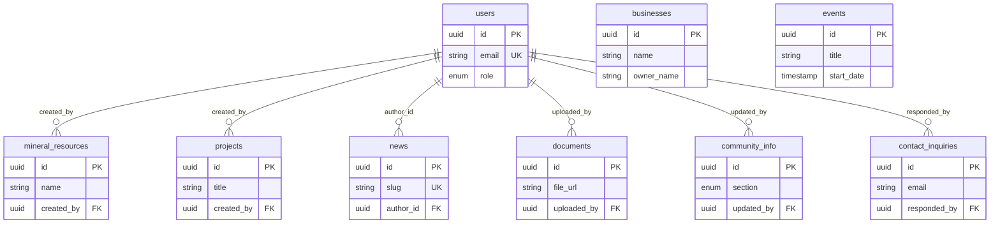
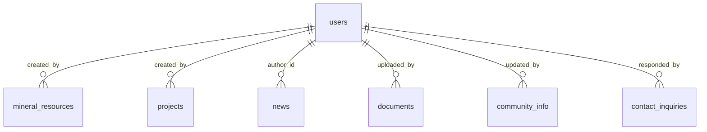

# Ikoha Community Development — ERD (Mermaid)

Copy the block you need into [Mermaid Live](https://mermaid.live) or your docs.  
**Database:** "Ikoha Community Development"

---

## Full ERD (all tables and attributes)

```mermaid
erDiagram
    users ||--o{ mineral_resources : "created_by"
    users ||--o{ projects : "created_by"
    users ||--o{ news : "author_id"
    users ||--o{ documents : "uploaded_by"
    users ||--o{ community_info : "updated_by"
    users ||--o{ contact_inquiries : "responded_by"

    users {
        uuid id PK
        string email UK
        string password_hash
        string full_name
        enum role "admin,member,visitor"
        string phone
        string address
        string profile_image_url
        bool is_verified
        timestamp created_at
        timestamp updated_at
        timestamp last_login
    }

    mineral_resources {
        uuid id PK
        string name
        enum category "metallic,non-metallic,energy,precious"
        text description
        string location_description
        decimal coordinates_lat
        decimal coordinates_lng
        string estimated_reserves
        enum extraction_status "active,inactive,planned,exploration"
        string mining_company
        string license_number
        date license_expiry
        uuid created_by FK
        timestamp created_at
        timestamp updated_at
    }

    projects {
        uuid id PK
        string title
        text description
        enum category "infrastructure,education,healthcare,water,energy,other"
        enum status "planning,in_progress,completed,on_hold"
        date start_date
        date expected_completion_date
        date actual_completion_date
        decimal budget
        string location
        int progress_percentage
        uuid created_by FK
        timestamp created_at
        timestamp updated_at
    }

    businesses {
        uuid id PK
        string name
        enum category "retail,service,manufacturing,agriculture,mining,other"
        text description
        string owner_name
        string email
        string phone
        string address
        bool is_verified
        timestamp created_at
        timestamp updated_at
    }

    news {
        uuid id PK
        string title
        string slug UK
        text content
        string excerpt
        enum category "general,development,minerals,events,announcements"
        string featured_image_url
        uuid author_id FK
        bool is_published
        timestamp published_at
        int views_count
        timestamp created_at
        timestamp updated_at
    }

    events {
        uuid id PK
        string title
        text description
        enum event_type "meeting,festival,workshop,celebration,other"
        timestamp start_date
        timestamp end_date
        string location
        string organizer
        bool is_published
        timestamp created_at
        timestamp updated_at
    }

    documents {
        uuid id PK
        string title
        text description
        enum category "legal,financial,environmental,technical,reports,other"
        string file_url
        string file_type
        bool is_public
        uuid uploaded_by FK
        int download_count
        timestamp created_at
        timestamp updated_at
    }

    community_info {
        uuid id PK
        enum section "history,demographics,culture,leadership,location"
        string title
        text content
        jsonb images
        int display_order
        bool is_active
        uuid updated_by FK
        timestamp created_at
        timestamp updated_at
    }

    contact_inquiries {
        uuid id PK
        string name
        string email
        string phone
        string subject
        text message
        enum inquiry_type "general,investment,partnership,media,other"
        enum status "new,in_progress,resolved,archived"
        uuid responded_by FK
        text response_notes
        timestamp created_at
        timestamp updated_at
    }
```

---

## Compact ERD (relationships + key fields only)

---

## Relationships only (no attributes)

