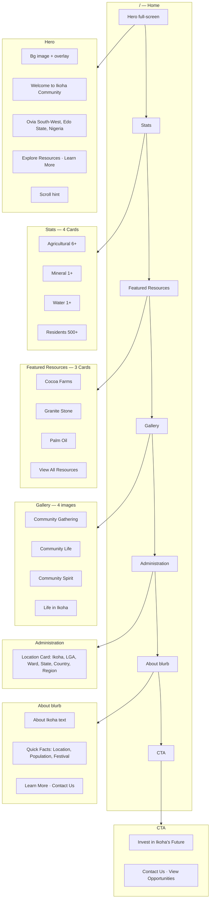
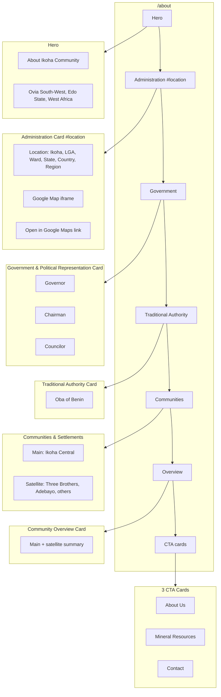
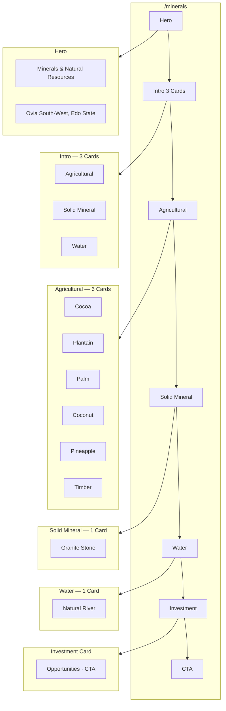
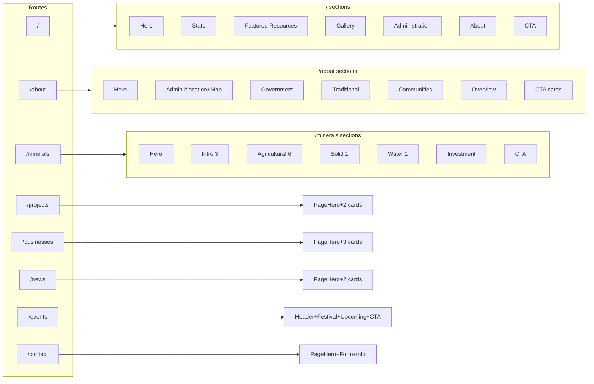
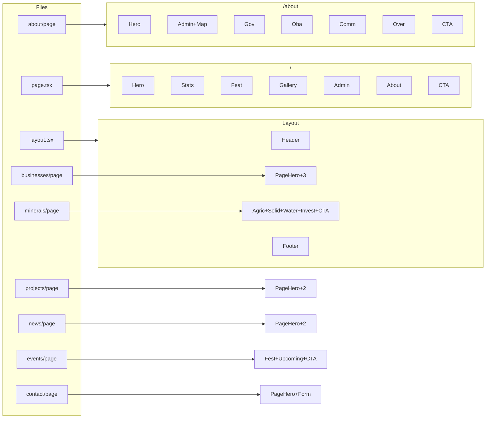
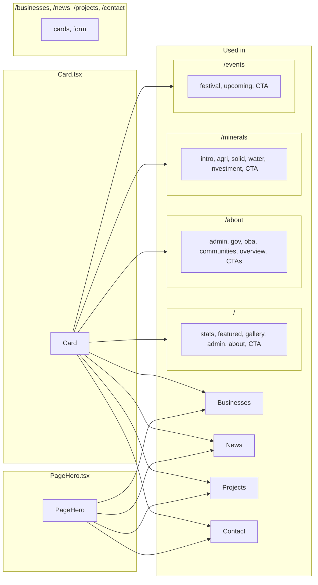

# Ikoha Community Development — Full Website in Mermaid

Complete Mermaid diagrams to **create** or **document** the full website.  
Use in [Mermaid Live](https://mermaid.live). For very large diagrams, paste one block at a time.

---

## 1. Full website — layout + all pages (overview)

```mermaid
flowchart TB
    subgraph Layout["Every page (layout.tsx)"]
        H[Header]
        B[Banner]
        M[Main]
        F[Footer]
        H --> B --> M --> F
    end

    subgraph Header["Header"]
        H1[Logo + Ikoha Community]
        H2[Nav: Home About Minerals Projects Businesses News Events Contact]
        H3[Contact CTA]
        H4[Mobile menu]
    end

    subgraph Banner["Construction Banner"]
        B1[Site Under Construction]
        B2[ASENOGUAN NIG LTD · Email]
    end

    subgraph Footer["Footer"]
        F1[Brand, logo, Ovia South-West]
        F2[About · Resources · Contact links]
        F3[Copyright · ASENOGUAN]
    end

    subgraph Pages["Main = page content by route"]
        P0[/]
        P1[/about]
        P2[/minerals]
        P3[/projects]
        P4[/businesses]
        P5[/news]
        P6[/events]
        P7[/contact]
        E[error / not-found / loading]
    end

    H --> Header
    B --> Banner
    M --> Pages
    F --> Footer
```

---

## 2. Home page (/) — full structure



---

## 3. About page (/about) — full structure



---

## 4. Minerals page (/minerals) — full structure



---

## 5. Projects, Businesses, News, Events, Contact — structure

```mermaid
flowchart TB
    subgraph Projects["/projects"]
        P1[PageHero: Community Development Projects]
        P2[Card: Project Dashboard]
        P3[Card: Submit a Project Idea]
        P1 --> P2
        P1 --> P3
    end

    subgraph Businesses["/businesses"]
        B1[PageHero: Local Business Directory]
        B2[Card: Directory]
        B3[Card: Promote Your Business]
        B4[Card: Investment & Partnerships]
        B1 --> B2 & B3 & B4
    end

    subgraph News["/news"]
        N1[PageHero: News]
        N2[Card: Latest News]
        N3[Card: Community Announcements]
        N1 --> N2 & N3
    end

    subgraph Events["/events"]
        E1[Page header: Events & Festivals]
        E2[Card: Ikoha Annual Festival — details]
        E3[Upcoming Events — Card list]
        E4[CTA: Join Us, Contact · View News]
        E1 --> E2 --> E3 --> E4
    end

    subgraph Contact["/contact"]
        C1[PageHero: Contact + MapPin, Phone meta]
        C2[Form: name, email, phone, subject, message, submit]
        C3[Contact info card]
        C1 --> C2 --> C3
    end
```



---

## 6. All routes + sections (flat)



---

## 7. Full website — one big diagram (layout + pages + components)

```mermaid
flowchart TB
    subgraph LAYOUT["LAYOUT — all pages"]
        direction TB
        HEAD[Header: Logo, Nav, Contact CTA, Mobile]
        BAN[Construction Banner: Under construction, ASENOGUAN, email]
        MAIN[Main]
        FOOT[Footer: Brand, About, Resources, Contact, Copyright]
        HEAD --> BAN --> MAIN --> FOOT
    end

    subgraph MAIN_PAGES["MAIN CONTENT by route"]
        direction TB

        subgraph HOME["/ — Home"]
            H1[Hero] --> H2[Stats 4] --> H3[Featured 3] --> H4[Gallery 4] --> H5[Admin] --> H6[About] --> H7[CTA]
        end

        subgraph ABOUT["/about"]
            A1[Hero] --> A2[Admin+Map] --> A3[Gov] --> A4[Oba] --> A5[Communities] --> A6[Overview] --> A7[CTA 3]
        end

        subgraph MIN["/minerals"]
            M1[Hero] --> M2[Intro 3] --> M3[Agri 6] --> M4[Solid 1] --> M5[Water 1] --> M6[Invest] --> M7[CTA]
        end

        subgraph OTH["/projects, /businesses, /news"]
            O1[PageHero] --> O2[Cards 2–3]
        end

        subgraph EV["/events"]
            E1[Header] --> E2[Festival Card] --> E3[Upcoming] --> E4[CTA]
        end

        subgraph CONT["/contact"]
            C1[PageHero] --> C2[Form] --> C3[Info]
        end
    end

    subgraph COMP["Components"]
        Header[Header.tsx]
        Banner[layout]
        Footer[Footer.tsx]
        Card[Card.tsx]
        PageHero[PageHero.tsx]
    end

    MAIN --> MAIN_PAGES
    HOME --> Card
    ABOUT --> Card
    MIN --> Card
    EV --> Card
    OTH --> PageHero
    CONT --> PageHero
    LAYOUT --> COMP
```



---

## 8. File → page → sections (create map)



---

## 9. Navigation flow (user clicks)

```mermaid
flowchart TD
    Start([User])
    Start --> Header
    Header --> H[/]
    Header --> A[/about]
    Header --> Mi[/minerals]
    Header --> Pr[/projects]
    Header --> B[/businesses]
    Header --> N[/news]
    Header --> E[/events]
    Header --> C[/contact]
    Header --> ContactBtn[/contact]

    H -->|Explore Resources| Mi
    H -->|Learn More| A
    H -->|View All Resources| Mi
    H -->|Learn More About Us| A
    H -->|Contact Us| C
    H -->|View Opportunities| Mi

    A -->|Contact, Minerals, About links| C
    A -->|#location| A

    Mi -->|Links| C

    E -->|Contact Us| C
    E -->|View News| N

    C -->|Submit| FormSent[Form submitted]
```

---

## 10. Component → where used



---

## How to use

- **Copy one block** (without the ` ```mermaid ` fence if your tool expects raw Mermaid) into [mermaid.live](https://mermaid.live).
- **Diagram 7** is the most complete single view; if it’s too large, use **1** (overview) plus **2–5** (per-page).
- **Diagram 9** is for navigation/UX; **10** for component usage.

---

*Ikoha Community Development — Full website in Mermaid*
