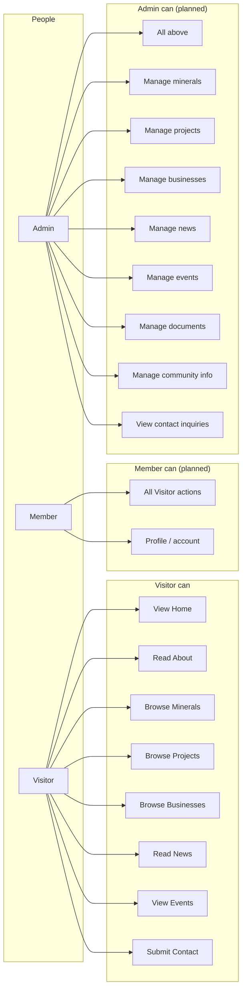
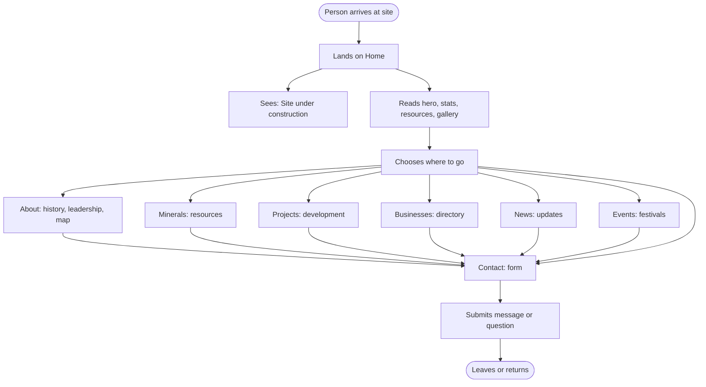
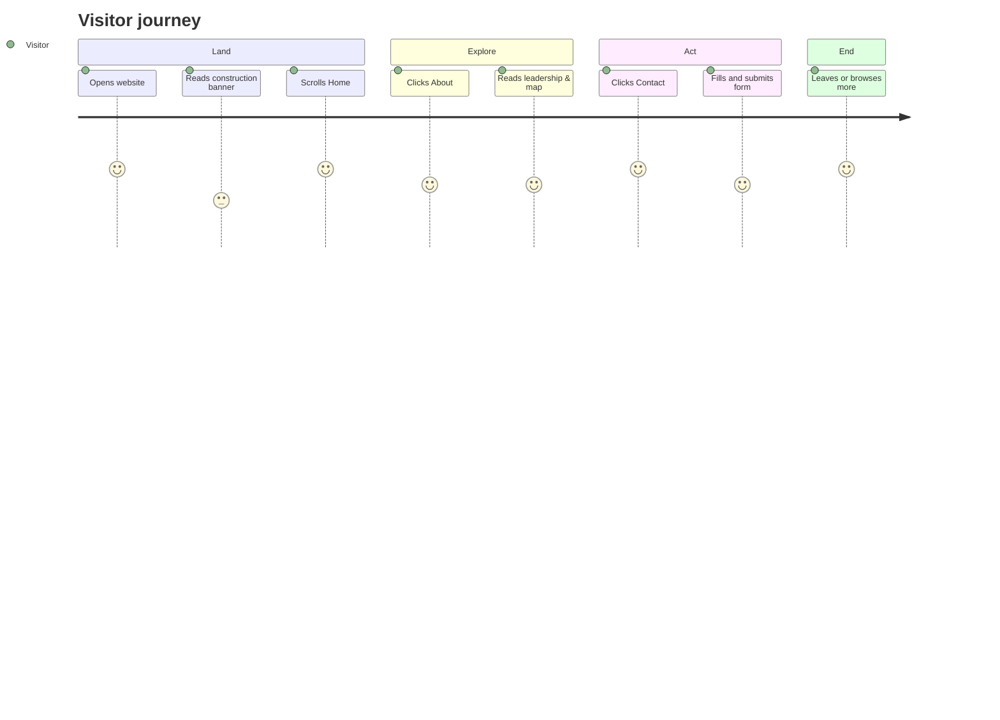
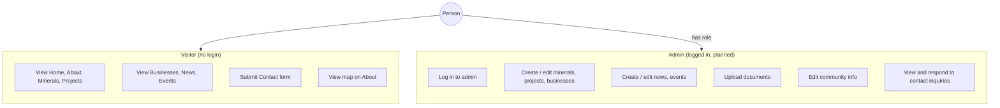
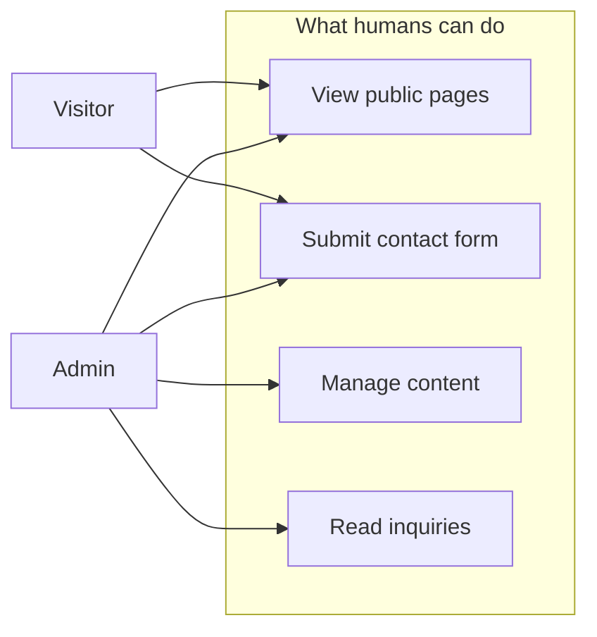
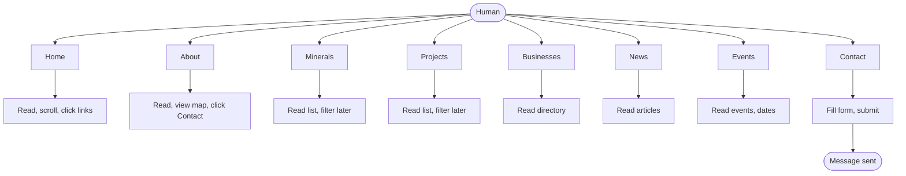
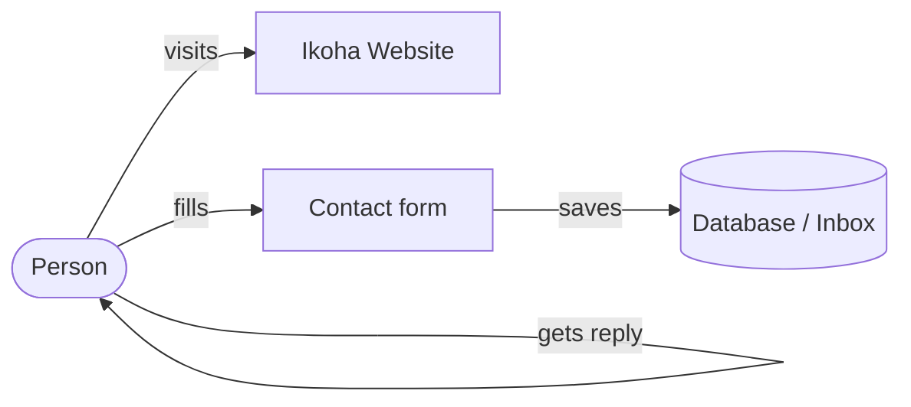
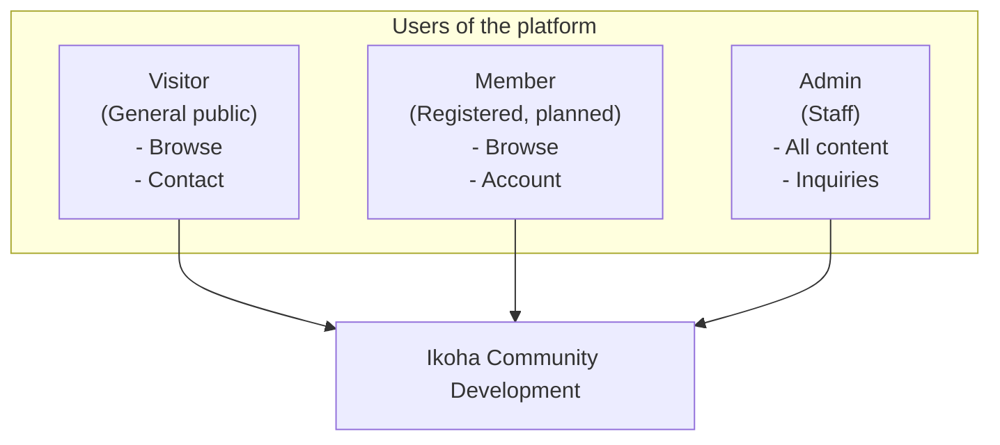

# Ikoha Community Development — Human / User Diagrams

Mermaid diagrams from a **human (user) perspective**: who uses the app, what they do, and how they move through it.  
Use in [Mermaid Live](https://mermaid.live) or your docs.

---

## 1. User roles and what they can do



---

## 2. User journey — Visitor (typical path)



---

## 3. User journey — Simple (one path)



---

## 4. Use case style — Actors and actions



---

## 5. Who does what (matrix style in Mermaid)



---

## 6. Human → Page → Action (flow)



---

## 7. Simple “human in the loop” (high level)



---

## 8. Persona / user types (text in nodes)



---

## How to use

- Paste any ` ```mermaid ` block into [mermaid.live](https://mermaid.live) to edit or export PNG/SVG.
- **Journey** (section 3): Mermaid `journey` syntax; good for step-by-step experience.
- **Flowcharts** (sections 1, 2, 4, 5, 6, 7, 8): Use for roles, journeys, and use-case style views.

---

*Ikoha Community Development — Human / user diagrams*
