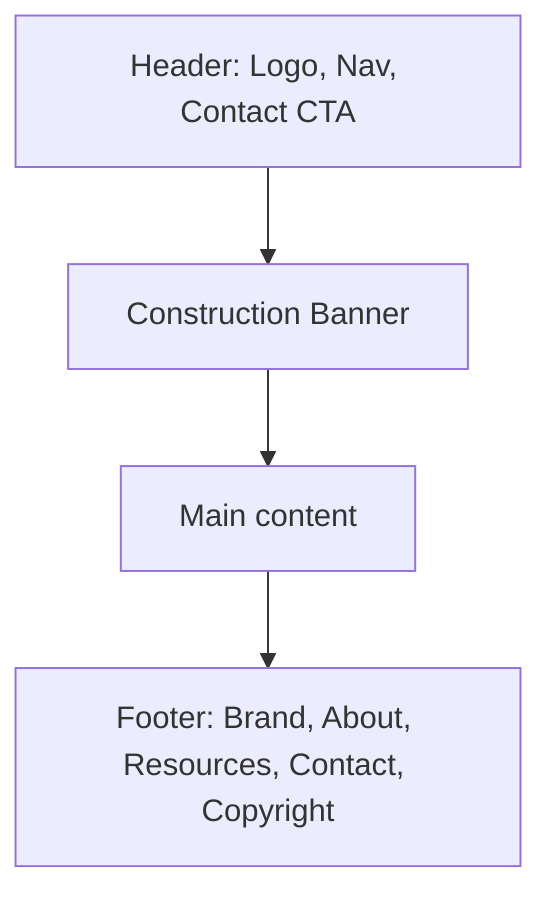
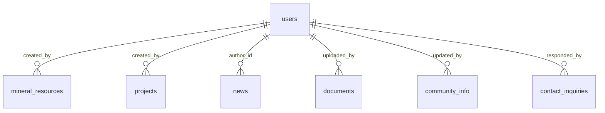
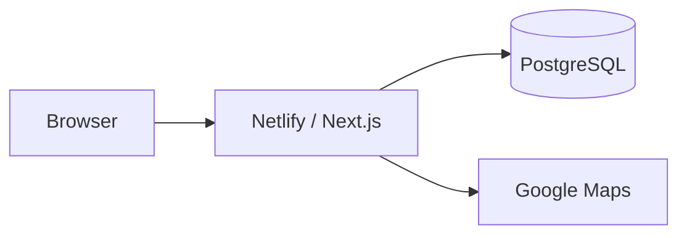

# Ikoha Community Development Platform

A comprehensive web platform for the Ikoha Community in Ovia South-West, Edo State, Nigeria, showcasing mineral resources, community development projects, and fostering local engagement.

---

## 🚀 Features

- **Community Information Hub** — History, demographics, and location details
- **Mineral Resources Management** — Comprehensive inventory and mapping
- **Development Projects Tracking** — Active and completed projects
- **Local Business Directory** — Community businesses and services
- **News & Events** — Community updates and event calendar
- **Resource Library** — Documents and reports
- **Contact & Engagement** — Forms and communication channels
- **Admin Dashboard** — Content management system (planned)

---

## 🛠️ Technology Stack

| Layer | Technology | Role |
|-------|------------|------|
| **Framework** | Next.js 14+ (App Router) | Routing, SSR, layout |
| **Language** | TypeScript | Typing |
| **Styling** | Tailwind CSS | Utility classes, theme (primary, secondary, accent) |
| **UI** | Bootstrap 5 (minimal) | Grid, some components |
| **Motion** | Framer Motion, AOS | Animations, scroll effects |
| **Icons** | Lucide React | Nav, stats, sections |
| **Fonts** | Inter (body), Poppins (headings) | Google Fonts |
| **Database** | PostgreSQL (planned) | Database name: `"Ikoha Community Development"` |
| **Maps** | Google Maps (embed / API) | About page, location |
| **Deploy** | Netlify | `netlify.toml`, `@netlify/plugin-nextjs` |

---

## 📐 Website Look & Layout

Every page shares this structure (top to bottom):



- **Header** — Sticky, white; logo, 8 nav links (Home, About, Minerals, Projects, Businesses, News, Events, Contact), Contact CTA; mobile menu.
- **Construction Banner** — Gold bar: “Site Under Construction”, ASENOGUAN NIG LTD, email.
- **Main** — Hero or PageHero or title, then sections (stats, cards, gallery, form, etc.), optional CTA.
- **Footer** — Gradient primary; Brand, About, Resources, Contact links; copyright, ASENOGUAN NIG LTD.

### Page types

| Type | Example | Main blocks |
|------|---------|-------------|
| **Home** | `/` | Full-screen hero → Stats (4) → Featured Resources (3) → Gallery → Administration → About → CTA |
| **Inner** | `/about` | Hero block → Sections, Cards, map |
| **PageHero** | `/businesses`, `/news`, `/projects` | PageHero (gradient, icon, title) → Body |
| **Form** | `/contact` | Title → Contact form |

### Design tokens

| Token | Value | Use |
|-------|--------|-----|
| **primary** | `#2D5016` | Buttons, nav, footer, hero |
| **primary-light** | `#4A7C2A` | Gradients |
| **primary-dark** | `#1A3009` | Footer top, darker areas |
| **secondary** | `#D4AF37` | Banner, accents, CTAs |
| **accent** | `#1E3A8A` | Government/official |
| **Content width** | `max-w-7xl` | Main content |

### Components

| Component | File | Role |
|-----------|------|------|
| Header | `Header.tsx` | Logo, nav, Contact CTA, mobile menu |
| Construction Banner | `layout.tsx` | Under-construction notice |
| Footer | `Footer.tsx` | Links, copyright |
| Card | `Card.tsx` | Stats, resources, leadership |
| PageHero | `PageHero.tsx` | Top block on Businesses, News, Projects |

> Full layout, wireframes, and tech diagrams: [WEBSITE_FRAMEWORK.md](./WEBSITE_FRAMEWORK.md)

---

## 🗄️ Database & ERD

**Database name:** `"Ikoha Community Development"`

### Tables (9)

| Table | Role |
|-------|------|
| **users** | Auth, roles (admin, member, visitor) |
| **mineral_resources** | Minerals; `created_by` → users |
| **projects** | Development projects; `created_by` → users |
| **businesses** | Business directory |
| **news** | News; `author_id` → users |
| **events** | Events & festivals |
| **documents** | Files; `uploaded_by` → users |
| **community_info** | About sections; `updated_by` → users |
| **contact_inquiries** | Contact form; `responded_by` → users |

### ERD — Relationships (Mermaid)



> Full ERD (all attributes): [ERD_MERMAID.md](./ERD_MERMAID.md)  
> Schema and setup: [DATABASE_SCHEMA.md](./DATABASE_SCHEMA.md), [DATABASE_SETUP.md](./DATABASE_SETUP.md)

---

## 👤 User Roles & Journeys

| Role | What they can do |
|------|------------------|
| **Visitor** | View all public pages, submit contact form |
| **Member** (planned) | All visitor actions + profile/account |
| **Admin** (planned) | Manage minerals, projects, businesses, news, events, documents, community info; view/respond to contact inquiries |

> User journeys, use-case style, and human-in-the-loop: [HUMAN_DIAGRAMS.md](./HUMAN_DIAGRAMS.md)

---

## 🗺️ Routes & Sitemap

| Route | Page | Description |
|-------|------|-------------|
| `/` | Home | Hero, stats, resources, gallery, administration, CTA |
| `/about` | About | History, leadership, map, `#location` |
| `/minerals` | Minerals | Mineral resources |
| `/projects` | Projects | Development projects |
| `/businesses` | Businesses | Business directory |
| `/news` | News | News & updates |
| `/events` | Events | Events & festivals |
| `/contact` | Contact | Contact form |
| — | `error.tsx`, `not-found.tsx`, `loading.tsx` | Error, 404, loading |

---

## 📊 Diagrams & Architecture

| Doc | Contents |
|-----|----------|
| [DIAGRAMS.md](./DIAGRAMS.md) | ERD, system architecture, sitemap, component hierarchy, data flow, quick reference |
| [ERD_MERMAID.md](./ERD_MERMAID.md) | ERD in Mermaid (full, compact, relationships-only) |
| [HUMAN_DIAGRAMS.md](./HUMAN_DIAGRAMS.md) | User roles, visitor journey, use-case style, human-in-the-loop |
| [WEBSITE_FRAMEWORK.md](./WEBSITE_FRAMEWORK.md) | Layout wireframes, page templates, tech stack, components, design tokens, file→look mapping |

### System architecture (high level)



---

## 📁 Project Structure

See [FOLDER_STRUCTURE.md](./FOLDER_STRUCTURE.md) for the full tree. Summary:

```
src/
├── app/           # Routes: layout, page, about, businesses, contact, events, minerals, news, projects, error, not-found, loading
├── components/    # layout (Header, Footer), ui (Card, PageHero)
├── lib/           # utils
└── styles/        # globals.css
```

---

## 🚦 Getting Started

### Prerequisites

- Node.js 18+ and npm 9+
- PostgreSQL (or SQLite for development)
- Git

### Installation

1. **Clone the repository**
   ```bash
   git clone https://github.com/asenlucky9/IkohaCommunity.git
   cd IkohaCommunity
   ```

2. **Install dependencies**
   ```bash
   npm install
   ```

3. **Set up environment variables**
   ```bash
   cp env.example.txt .env.local
   # Edit .env.local with your configuration
   ```

4. **Set up the database**
   - Create a PostgreSQL database: `createdb "Ikoha Community Development"` (quotes required)
   - Set `DATABASE_URL` in `.env.local`
   - Run `create_tables.sql` (see [DATABASE_SETUP.md](./DATABASE_SETUP.md))

5. **Run the development server**
   ```bash
   npm run dev
   ```

6. **Open** [http://localhost:3000](http://localhost:3000)

---

## 📝 Available Scripts

- `npm run dev` — Start development server (port 3000)
- `npm run build` — Build for production
- `npm run start` — Start production server
- `npm run lint` — Run ESLint
- `npm run type-check` — TypeScript type checking

---

## 🌐 Deployment (Netlify)

1. Connect the repository to Netlify.
2. Build settings are in `netlify.toml` (Next.js plugin).
3. Set environment variables in the Netlify dashboard.
4. Deploy.

---

## 📚 Documentation

| Document | Description |
|----------|-------------|
| [PROJECT_PLAN.md](./PROJECT_PLAN.md) | Features and ideas |
| [DATABASE_SCHEMA.md](./DATABASE_SCHEMA.md) | Database design |
| [DATABASE_SETUP.md](./DATABASE_SETUP.md) | Database setup |
| [WIREFRAMES.md](./WIREFRAMES.md) | UI/UX layouts |
| [FOLDER_STRUCTURE.md](./FOLDER_STRUCTURE.md) | Project organization |
| [DIAGRAMS.md](./DIAGRAMS.md) | ERD, architecture, sitemap, components, data flow |
| [ERD_MERMAID.md](./ERD_MERMAID.md) | ERD in Mermaid |
| [HUMAN_DIAGRAMS.md](./HUMAN_DIAGRAMS.md) | User roles, journeys, use cases |
| [WEBSITE_FRAMEWORK.md](./WEBSITE_FRAMEWORK.md) | Website look, layout, tech stack, design tokens |
| [FULL_WEBSITE_MERMAID.md](./FULL_WEBSITE_MERMAID.md) | Full website in Mermaid: all pages, sections, nav, components |

---

## 🤝 Contributing

This is a community project. Contributions are welcome.

---

## 📄 License

[Specify your license here]

---

## 📧 Contact

- **Site:** Use the contact form on the website.
- **Developer:** ASENOGUAN NIG LTD · asenlucky9@gmail.com

---

**Location:** Ovia South-West, Edo State, South South Nigeria, West Africa
