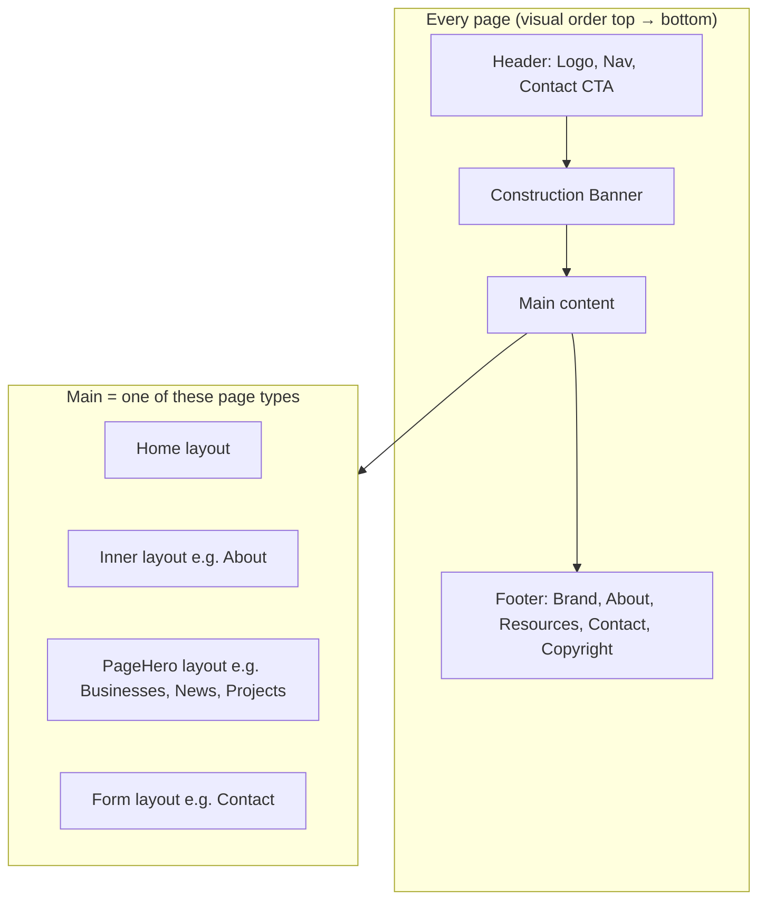
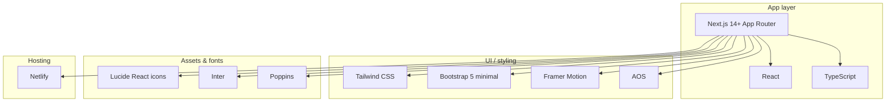
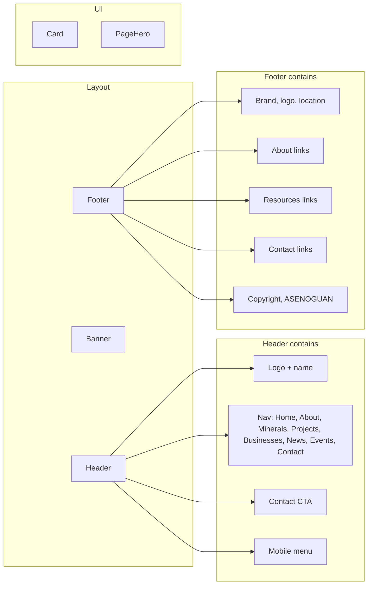
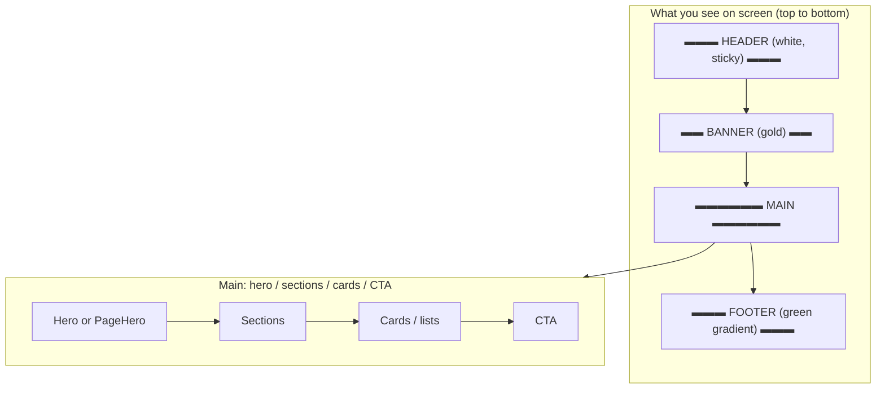

# Ikoha Community Development — Website Look & Framework

How the website **looks** (layout, blocks, structure) and the **tech framework** (stack, components).  
Use the Mermaid blocks in [Mermaid Live](https://mermaid.live) or your docs.

---

## 1. How every page looks (visual layout)

### ASCII wireframe (side view)

```
┌─────────────────────────────────────────────────────────────────┐
│  HEADER (sticky, white, shadow)                                   │
│  [Logo + "Ikoha Community" | Home About Minerals Projects ...]   │
│  [Contact CTA]                                                    │
├─────────────────────────────────────────────────────────────────┤
│  CONSTRUCTION BANNER (gold / secondary)                           │
│  [🚧 Site Under Construction · Developed by ASENOGUAN · Email]   │
├─────────────────────────────────────────────────────────────────┤
│                                                                   │
│  MAIN (page content, max-w-7xl, px-4 sm:px-6 lg:px-8)            │
│  ┌─────────────────────────────────────────────────────────────┐ │
│  │  Hero or PageHero or Title block                             │ │
│  └─────────────────────────────────────────────────────────────┘ │
│  ┌─────────────────────────────────────────────────────────────┐ │
│  │  Section 1 (e.g. stats, cards, text)                         │ │
│  └─────────────────────────────────────────────────────────────┘ │
│  ┌─────────────────────────────────────────────────────────────┐ │
│  │  Section 2 …                                                 │ │
│  └─────────────────────────────────────────────────────────────┘ │
│  ┌─────────────────────────────────────────────────────────────┐ │
│  │  Optional CTA                                                │ │
│  └─────────────────────────────────────────────────────────────┘ │
│                                                                   │
├─────────────────────────────────────────────────────────────────┤
│  FOOTER (gradient primary-dark → primary, white text)            │
│  [Brand | About | Resources | Contact]  [Copyright · ASENOGUAN]  │
└─────────────────────────────────────────────────────────────────┘
```

### Mermaid — page structure (blocks)



---

## 2. Page templates (how each page type looks)

### Home

```
┌─ Hero (full viewport, bg image + overlay) ─────────────────────┐
│  "Welcome to Ikoha Community"                                  │
│  Ovia South-West, Edo State, Nigeria                           │
│  [Explore Resources] [Learn More]                              │
│  scroll hint                                                    │
├─ Stats (4 cards: Agricultural, Mineral, Water, Residents) ─────┤
├─ Featured Resources (3 cards: Cocoa, Granite, Palm Oil) ───────┤
├─ Community Gallery (2–4 images) ───────────────────────────────┤
├─ Administration (Chairman, Gov, Councilor, Oba cards) ──────────┤
├─ About blurb + CTA ────────────────────────────────────────────┤
└─ Final CTA (primary bg, buttons) ──────────────────────────────┘
```

### Inner page (e.g. About)

```
┌─ Hero block (gradient primary, title, subtitle) ────────────────┐
│  "About Ikoha Community" · Ovia South-West …                    │
├─ Sections (Cards, text, images, map) ───────────────────────────┤
│  - Ikoha Administration (with #location)                        │
│  - Main + satellite communities                                 │
│  - Leadership (Chairman, Governor, Councilor, Oba)              │
│  - Map (Google) + link                                          │
└─ (optional CTA) ────────────────────────────────────────────────┘
```

### PageHero page (Businesses, News, Projects)

```
┌─ PageHero (gradient primary, icon, title, description) ─────────┐
│  [icon] Title · short description                               │
├─ Body (cards, list, or custom sections) ────────────────────────┤
└─ Optional CTA ──────────────────────────────────────────────────┘
```

### Contact

```
┌─ Title / small hero ────────────────────────────────────────────┐
├─ Contact form (name, email, subject, message, submit) ───────────┤
└─ (optional) info / map ──────────────────────────────────────────┘
```

### Mermaid — page templates

```mermaid
flowchart TD
    subgraph Home["Home"]
        H1[Hero full-screen]
        H2[Stats 4]
        H3[Featured Resources 3]
        H4[Gallery]
        H5[Administration]
        H6[About blurb]
        H7[CTA]
        H1 --> H2 --> H3 --> H4 --> H5 --> H6 --> H7
    end

    subgraph Inner["Inner e.g. About"]
        I1[Hero block]
        I2[Sections + Cards + Map]
        I1 --> I2
    end

    subgraph PageHero["PageHero e.g. Businesses, News, Projects"]
        P1[PageHero]
        P2[Body]
        P1 --> P2
    end

    subgraph Contact["Contact"]
        C1[Title]
        C2[Form]
        C1 --> C2
    end
```



---

## 3. Tech / framework stack

### Mermaid — framework layers



### Stack table

| Layer | Technology | Role |
|-------|------------|------|
| **Framework** | Next.js 14+ (App Router) | Routing, SSR, layout |
| **Language** | TypeScript | Typing |
| **Styling** | Tailwind CSS | Utility classes, theme (primary, secondary, accent) |
| **UI library** | Bootstrap 5 (minimal) | Grid, some components (container off) |
| **Motion** | Framer Motion | Header, cards, hero, mobile menu |
| **Scroll effects** | AOS | fade-up, fade-in on scroll |
| **Icons** | Lucide React | Nav, stats, sections |
| **Fonts** | Inter (body), Poppins (headings) | Google Fonts |
| **Deploy** | Netlify | `netlify.toml`, Next.js plugin |

---

## 4. Component building blocks

### Mermaid — components



### Component list

| Component | File | What it does |
|-----------|------|--------------|
| **Header** | `Header.tsx` | Sticky; logo, nav (8 links + icons), Contact CTA; mobile menu (Framer). |
| **Construction Banner** | `layout.tsx` | Gold bar: “Site Under Construction”, short text, ASENOGUAN, email. |
| **Footer** | `Footer.tsx` | Gradient primary; Brand, About, Resources, Contact; copyright, ASENOGUAN. |
| **Card** | `Card.tsx` | White, rounded, shadow, hover; used for stats, resources, leadership, etc. |
| **PageHero** | `PageHero.tsx` | Gradient primary, optional icon/eyebrow, title, description; used on Businesses, News, Projects. |

---

## 5. Design tokens (look & feel)

| Token | Value | Use |
|-------|--------|-----|
| **primary** | `#2D5016` | Buttons, nav active, footer, hero, links. |
| **primary-light** | `#4A7C2A` | Gradients, highlights. |
| **primary-dark** | `#1A3009` | Footer top, darker gradients. |
| **secondary** | `#D4AF37` | Construction banner, accents, CTAs. |
| **secondary-light** | `#E5C866` | Softer gold. |
| **secondary-dark** | `#B8941F` | Hover, borders. |
| **accent** | `#1E3A8A` | Government/official, some icons. |
| **max-width** | `max-w-7xl` | Main content. |
| **padding** | `px-4 sm:px-6 lg:px-8` | Page horizontal. |
| **body font** | Inter | General text. |
| **heading font** | Poppins | h1–h6. |

---

## 6. One-screen “how it looks” (Mermaid)



---

## 7. File → “look” mapping

| What you see | Comes from |
|--------------|------------|
| Header on all pages | `layout.tsx` → `Header.tsx` |
| Gold construction bar | `layout.tsx` (inline) |
| Footer on all pages | `layout.tsx` → `Footer.tsx` |
| Home hero, stats, gallery, admin | `app/page.tsx` |
| About hero, leadership, map | `app/about/page.tsx` |
| Businesses/News/Projects top block | `PageHero` in each `page.tsx` |
| Cards (stats, resources, people) | `Card.tsx` in each page |
| Colors, spacing | `tailwind.config.js`, `globals.css` |

---

*Ikoha Community Development — Website look and framework*
